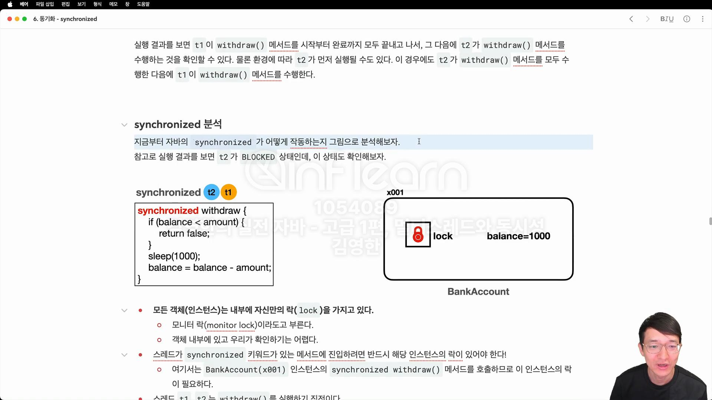

# 스케줄링
운영체제가 스레드를 어떻게 스케줄링 하는지 , 스케줄링 관점으로 알아봅시다.

운영체제는 내부에 스케줄링 큐를 가지고 잇고, 각각의 스레드는 스케줄링 큐에서 대기한다.

cpu에 어떤 프로그램이 얼마난큼 실행될지 운영체제가 결정
이것을 스케줄링이라 한다.
이때 단순히  시간으로만 작업을 분할하지는 않고, cpu를 최대한 활용할 수 있는 다양한 우선순위와 최적화 기법을 사용한다.
우리는 운영체제가 스케줄링을 수행하고, CPU를 최대한 사용하면서 작업이 골고루 수행될 수 있게 최적화한다는 정도로 이해하면 충분하다.

##  단일 코어 스케줄링
 스레드1,2,3이 있을 때 스케줄링 큐에 넣고
 cpu 코어가 하나의 스레드를 실행하는 방식을 말함
 
cpu코어에서 하나의 스레드가 실행되고 멈추고 다른 스레드를 실행하고 이전 스레드를 큐에 넣고 
나중에 다시 실행하는 방식으로 동작합니다.

## 멀티 코어 스케줄링
단일 코어 스케줄링처럼 동작하고 두 개 이상의 코어가 동시에 스레드를 실행하는 것을 말한다.

## 프로세스 스레드와 스케줄 - 정리
멀티태스킹과 스케줄링
- 멀티 태스킹이란 동시에 여러 작업을 수행하는 것을말한다.
- 이를 위해 운영체제는 스케줄링이라는 기법을 사용한다.
- 스케줄링은 cpu 시간을 여러 작업에 나누어 배분하는 방법이다.

프로세스와 스레드
- 프로세스는 실행 중인 프로그램의 인스턴스이다. 각 프로세스는 독립적인 메모리 공간을 가지며, 운영체제에서 독립된 실행 단위로 취급된다.
- 스레드는 프로세스 내에서 실행되는 작은 단위이다. 여러 스레드는 하나의 프로세스 내에서 자원을 공유하며, 프로세스의 코드, 데이터, 시스템 자원등을 공유한다. 실제로 CPU에 의해 실행되는 단위는 스레드다.

프로세서
- 멀티 프로세서의 프로세서, 즉 CPU를 말한다.

프로세스의 역할
- 프레스는 실행 환경을 제공합니다. 여기에는 메모리 공간, 파일 핸들, 시스템 자원(네트워크 연결) 등이 포함된다. 이는 프로세스가 컨테이너 역할을 한다는 의미이다.
- 프로세스 자체는 운영체제의 스케줄러에 의해 직접 실행되지 않으며, 프로세스 내의 스레드가 실행된다.
- 참고로 1개의 프로세스 안에 하나의 스레드만 실행되는 경우도 있고, 1개 프로세스 안에 여러개의 스레드가 실행되는 경우가 있다.

# 컨텍스트 스위칭
현재 작업하는 문맥을 뜻한다. 현재 작업하는 문맥이 변하기 때문에 컨텍스트 스위칭이다.
컨텍스트 스위칭 과정에서 이전에 실행중인 값으 메모리에 잠깐 저장하고, 이후에 다시 실행하는 시점에 저장된 값을 CPU에 다시 불러야한다.
이 과정에서 비용이 발생한다.

멀티스레드는 대부분 효율적이지만 , 컨텍스트 스위칭 과정에서 항상 효율적인 것은 아니다.

실무에서는 CPU+1 개수만큼 스레드를 가져가면 좋을 수 도있음
항상 그런건아님

## CPU 바운드 작업 VS I/O 바운드 작업
각각의 스레드가 하는 작업을 크게 2가지로 구분할 수있다.

- CPU-바운드 작업 (CPU-BOUND TASKS)
  - cpu 많이 쓰는 작업
- I/0 바운드 작업
  - 디스크, 네트워크 파일 시스템 등과 같은 입출력 작업을 많이 요규하는 작업을 의미한다.
  - 거의 CPU를 안쓰고 대기해서 I/O 작업이 완료될까지 대기한다.

## 웹 애플리케이션 서버
분야마다 다르겠지만, 실무에서는 CPU 바운드 작어보다, I/O 바운드 작업이 많다.

## 데몬 스레드 vs 사용자 스레드

## 사용자 스레드 
- 일반적으로 우리가 사용하는 스레드
- 프로그램의 주요 작업을 수행
- 작업이 완료될 때까지 실행
- 모든 user 스레드가 종료되면 JVM도 종료된다.

## 데몬 스레드
- 백그라운드에서 보조적인 작업을 수행한다.
- 모든 user 스레드가 종료되면 데몬 스레드는 자동으로 종료된다.
- 옵션을 통해 데몬 스레드를 생성할 수 있음
- daemonThread.setDaemon(true);   데몬이라면 main 이 끝나면 데몬 스레드의 동작은 멈춰버린다.

## 스레드를 만드는 방법 두 가지
1. extend 
2. Runnable (실무)

## extends 의 한계
- 다중 상속이 안되기 떄문에 thread 클래스를 상속받을 수 없을 수도있음
- runnable을 사용합시다.

## runnable 장점
- 상속의 자유로움
- 코드의 분리 : 스레드와 실행할 작업을 분리하여 가독성 업
- 여러 스레드가 동일한 ruannble 객체를 공유할 수 있어 자원 관리를 효율적으로 할 수 있다.

## 스레드의 상태 및 특징
- 스레드 id는 중복이 될 수 없지만, 이름은 중복이 가능하다.

- 스레드 우선순위
  - 개발자가 어떤 스레드를 우선으로 실행해줘라고 희망하는 거임 
  - 우선순위는 기본적으로 5다.
  - 높으면 많이 실행함
  - 높다고 항상 더 많이 실행되는게 아님
  - 실전에서 거의 안씀
- 스레드 그룹
  - 자주 사용 안함 
  - 기본적으로 모든 스레드는 그룹에 포함됨
  - 여러 스레드를 하나의 그룹으로 묶어서 특정 작업을 할 수 있음
  - 스레드는 부모에서 생성이 되기 때문에 부모스레드는 main임
  - 스레드는 기본 main 그룹에 포함되어 있다.

- 스레드의 상태
  - Thread.state 중 하나의 값
  - NEW : 스레드가 아직 시작되지 않는 상태
  - RUNNABLE : 스케줄러 대기열에 있거나 실행되고 있는 상태
  - BLOCKED : 스레드가 동기화 락을 기다리고 있는 상태 
  - WAITING : 스레드가 다른 스레드의 특정 작업이 완료되기를 기다리는 상태
    - 파일을 불러오거나 읽을 떄 기다리는 시간
  - TIMED_WAITING : 일정 시간 기다리는 상태
    - 시간 제한을 두고 일정 시간 이상 기다리는 상태
  - TERMINATED : 스레드가 실행을 마친 상태

## 스레드의 생명 주기
1. NEW -> RUNNABLE(BLOCK, WAITING, TIME_WAITING) -> Terminate

## 스레드 join
해당 스레드를 기다리고 실행하는 작업 
waiting과 같다.

## interrupt
- 스레드의 작업을 중지하고 싶다면 인터럽트를 사용
- 바로 스레드의 작업이 멈추는 게 아니라 thread.sleep 처럼 인터럽트 예외를 발생시키는 코드가 실행될 떄 딱 멈춘다.

### interrupt 사용방법
- thread.interrupt() : 인터럽트 거는 법
- thread.isInterrupted() : 인터럽트 상태
### 인터럽트 상태
- 대기상태의 스레드를 깨워 어떤 작업을 빠르게 할 수 있음
- main 스레드에서 thread.isInterrupted() 결과값
- main에서 인터럽트를 걸었으니 true로 된다.
- 인터럽트 걸린 해당 스레드는 예외로 넘어가면 false로 됨

## volatile
- thread가 동시에 자원에 접근할 때 volatile 사용해야 안전함

## yield
자바의 스레드가 RUNNABLE 상태일 때, 운영체제의 스케줄링은 다음과 같은 상태들을 가질 수 있다.
실행 상태(Running): 스레드가 CPU에서 실제로 실행 중이다.
실행 대기 상태(Ready): 스레드가 실행될 준비가 되었지만, CPU가 바빠서 스케줄링 큐에서 대기 중이다.
운영체제는 실행 상태의 스레드들을 잠깐만 실행하고 실행 대기 상태로 만든다. 그리고 실행 대기 상태의 스레드들을 잠
깐만 실행 상태로 변경해서 실행한다. 이 과정을 계속 반복한다. 참고로 자바에서는 두 상태를 구분할 수는 없다.

## yield()의 작동
Thread.yield() 메서드는 현재 실행 중인 스레드가 자발적으로 CPU를 양보하여 다른 스레드가 실행될 수
있도록 한다.
yield() 메서드를 호출한 스레드는 RUNNABLE 상태를 유지하면서 CPU를 양보한다. 즉, 이 스레드는 다시 스
케줄링 큐에 들어가면서 다른 스레드에게 CPU 사용 기회를 넘긴다.
자바에서 Thread.yield() 메서드를 호출하면 현재 실행 중인 스레드가 CPU를 양보하도록 힌트를 준다. 이는 스레
드가 자신에게 할당된 실행 시간을 포기하고 다른 스레드에게 실행 기회를 주도록 한다. 참고로 yield() 는 운영체제
의 스케줄러에게 단지 힌트를 제공할 뿐, 강제적인 실행 순서를 지정하지 않는다. 그리고 반드시 다른 스레드가 실행되
는 것도 아니다.
yield() 는 RUNNABLE 상태를 유지하기 때문에, 쉽게 이야기해서 양보할 사람이 없다면 본인 스레드가 계속 실행될
수 있다.

## 메모리 가시성 문제 (volatile)
멀티스레드에서 메인 스레드에서 값을 변경해도 다른 스레드의 값이 일치하지 않는다.

메모리 가시성 : 멀티스레드 환경에서 한 스레드가 변경한 값이 다른 스레드에서 언제 보이는지에 대한 것을 말한다.

캐시 메모리의 값이 변경 되는 시점은 cpu가 관리하기 때문에 알 수 없다.
주로 컨텍스트 스위칭이 일어날 때 된다고는 하는데 cpu 설계와 실행환경에 따라 다르기 때문에 정확한 시점은 알 수 없다.
원인
- 각 스레드 마다 메인 메모리가 아닌 캐쉬 메모리에서 값을 가져오기 때문에 값의 변경이 다른 스레드의 캐쉬 메모리에 반영이 되지 않는다.

해결법
- 메인 메모리에 직접 접근하면 됨 = volatile 사용
- 또는 스레드 동기화 기법(synchronized, ReentrantLock)을 사용
-> 성능이 떨어짐

## 동시성

두 개의 스레드 이상 공유 자원을 동시에 변경할 때 동시성 문제가 발생한다.
예를 들어, 출금을 두 스레드에서 한 계좌에 동시에 출금할 때 -값이 나오거나 완전히 동시에 처리되어 한 쪽 출금은 무시가 될 수 있다.|

해결법 
- synchronized를 이용

### 임계영역 (critical session: 위험한 영역)
여러 스레드가 동시에 접근하면 데이터의 불일치나 예상치 못한 동작이 발생할 수 있는 위험하고 또 중요한 코드 부분을 뜻한다.
출금 로직이 바로 임계영역이다.

### synchronized

- 자바 1.0 부터 나옴
- 모든 객체(인스턴스)는 내부에 자신만의 락을 가지고 있다.
  - 모니터 락이라고 부른다.
  - 객체 내부에 있고 우리가 확인하기는 어렵다.
- 스레드가 synchronized 키워드가 있는 메서드에 진입하려면 반드시 해당 인스턴스 락이 있어야한다.
  - bankAccount 인스턴스의 synchronized withdraw() 메서드를 호출하므로 이 인스턴스락이 필요하다.
- 스레드 t1, t2 withdraw()를 실행하기 직전이다.

1. t1이 BankAccount 락을 획득한다.
2. t2는 락이 없기 떄문에 blocked 상태로 변하고 , cpu 실행 스케줄러에 들어가지 않고 무한정 대기한다.
3. t1이 끝나면 객체에 다시 락을 반환한다.
4. t2가 락을 획득하여 blocked -> runnable 상태로 되어 코드를 실행한다.

tip
- 락을 획득하는 순서는 보장되지 않는다.
- volatile를 사용하지 않아도 synchronized 안에서 접근하는 변수의 메모리 가시성 문제는 해결된다.
- 

## synchronized 단점
한 스레드만 실행할 수 있어 너무 느리다.
해결법 : synchronized 영역을 최소화할 수 있는 블록을 사용하자

## 문제 정리
- 공유 자원이 final이라면? synchronized 안해줘도 된다. 어처피 변경이 되지 않고 읽기 떄문이다.
- 지역변수는 stack frame안에서 개별적으로 관리되기 떄문에 공유자원이 아니라서 동기화 문제에 신경 쓸 필요가 없다.

