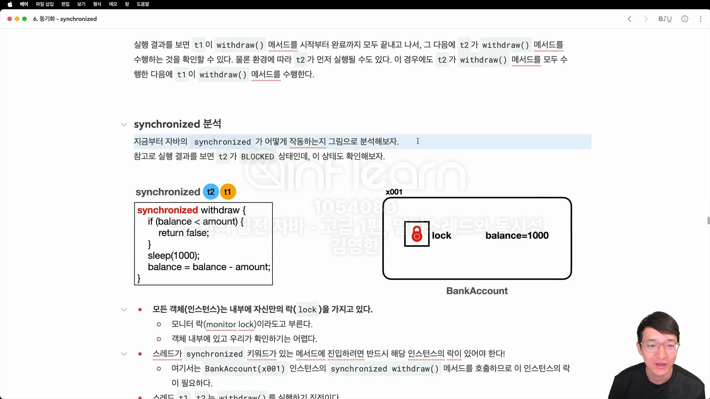
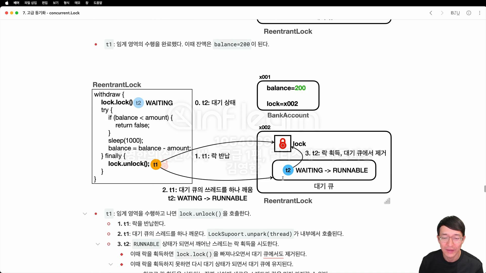
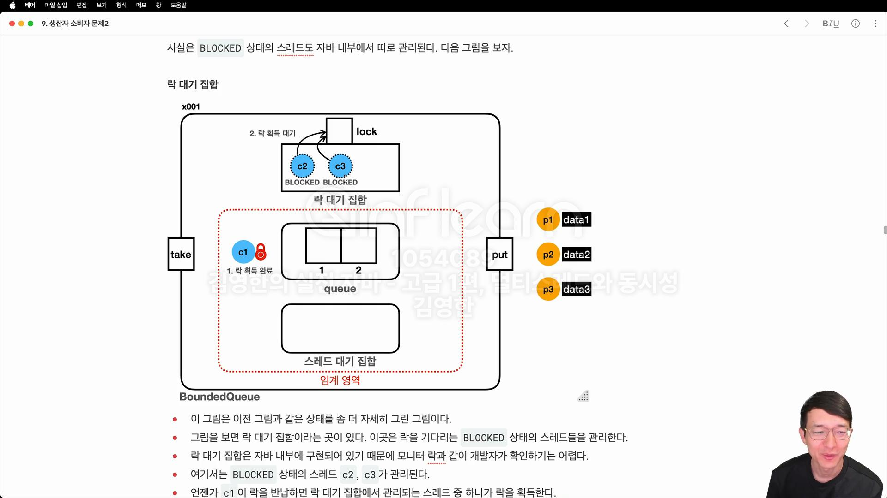
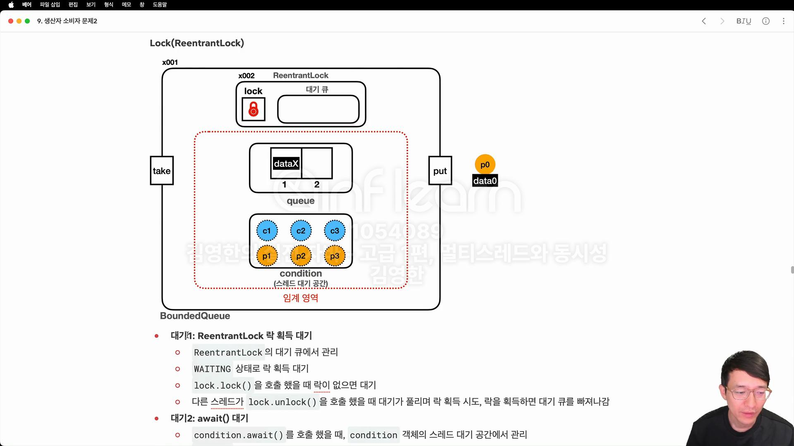
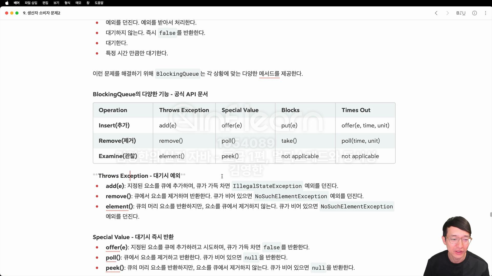
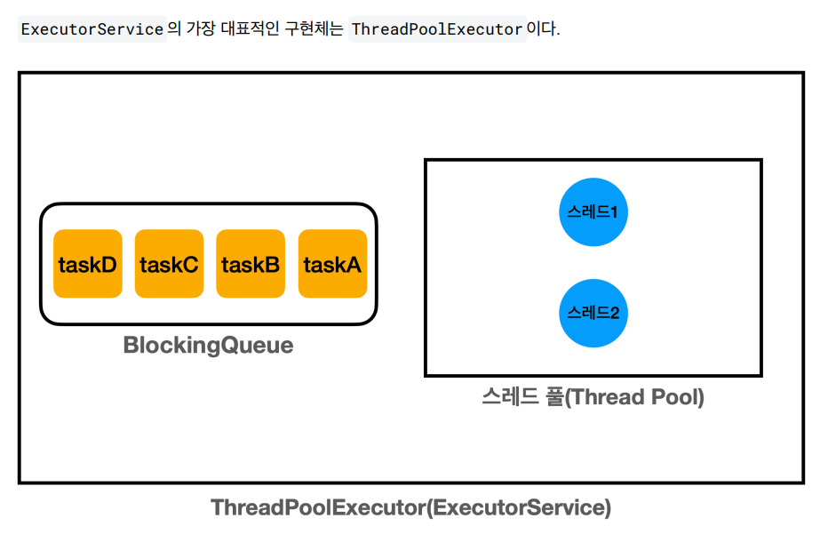

# 스케줄링
운영체제가 스레드를 어떻게 스케줄링 하는지 , 스케줄링 관점으로 알아봅시다.

운영체제는 내부에 스케줄링 큐를 가지고 잇고, 각각의 스레드는 스케줄링 큐에서 대기한다.

cpu에 어떤 프로그램이 얼마난큼 실행될지 운영체제가 결정
이것을 스케줄링이라 한다.
이때 단순히  시간으로만 작업을 분할하지는 않고, cpu를 최대한 활용할 수 있는 다양한 우선순위와 최적화 기법을 사용한다.
우리는 운영체제가 스케줄링을 수행하고, CPU를 최대한 사용하면서 작업이 골고루 수행될 수 있게 최적화한다는 정도로 이해하면 충분하다.


##  단일 코어 스케줄링
 스레드1,2,3이 있을 때 스케줄링 큐에 넣고
 cpu 코어가 하나의 스레드를 실행하는 방식을 말함
 
cpu코어에서 하나의 스레드가 실행되고 멈추고 다른 스레드를 실행하고 이전 스레드를 큐에 넣고 
나중에 다시 실행하는 방식으로 동작합니다.

## 멀티 코어 스케줄링
단일 코어 스케줄링처럼 동작하고 두 개 이상의 코어가 동시에 스레드를 실행하는 것을 말한다.


## 프로세스 스레드와 스케줄 - 정리
멀티태스킹과 스케줄링
- 멀티 태스킹이란 동시에 여러 작업을 수행하는 것을말한다.
- 이를 위해 운영체제는 스케줄링이라는 기법을 사용한다.
- 스케줄링은 cpu 시간을 여러 작업에 나누어 배분하는 방법이다.

프로세스와 스레드
- 프로세스는 실행 중인 프로그램의 인스턴스이다. 각 프로세스는 독립적인 메모리 공간을 가지며, 운영체제에서 독립된 실행 단위로 취급된다.
- 스레드는 프로세스 내에서 실행되는 작은 단위이다. 여러 스레드는 하나의 프로세스 내에서 자원을 공유하며, 프로세스의 코드, 데이터, 시스템 자원등을 공유한다. 실제로 CPU에 의해 실행되는 단위는 스레드다.

프로세서
- 멀티 프로세서의 프로세서, 즉 CPU를 말한다.

프로세스의 역할
- 프레스는 실행 환경을 제공합니다. 여기에는 메모리 공간, 파일 핸들, 시스템 자원(네트워크 연결) 등이 포함된다. 이는 프로세스가 컨테이너 역할을 한다는 의미이다.
- 프로세스 자체는 운영체제의 스케줄러에 의해 직접 실행되지 않으며, 프로세스 내의 스레드가 실행된다.
- 참고로 1개의 프로세스 안에 하나의 스레드만 실행되는 경우도 있고, 1개 프로세스 안에 여러개의 스레드가 실행되는 경우가 있다.


# 컨텍스트 스위칭
현재 작업하는 문맥을 뜻한다. 현재 작업하는 문맥이 변하기 때문에 컨텍스트 스위칭이다.
컨텍스트 스위칭 과정에서 이전에 실행중인 값으 메모리에 잠깐 저장하고, 이후에 다시 실행하는 시점에 저장된 값을 CPU에 다시 불러야한다.
이 과정에서 비용이 발생한다.

멀티스레드는 대부분 효율적이지만 , 컨텍스트 스위칭 과정에서 항상 효율적인 것은 아니다.

실무에서는 CPU+1 개수만큼 스레드를 가져가면 좋을 수 도있음
항상 그런건아님

## CPU 바운드 작업 VS I/O 바운드 작업
각각의 스레드가 하는 작업을 크게 2가지로 구분할 수있다.

- CPU-바운드 작업 (CPU-BOUND TASKS)
  - cpu 많이 쓰는 작업
- I/0 바운드 작업
  - 디스크, 네트워크 파일 시스템 등과 같은 입출력 작업을 많이 요규하는 작업을 의미한다.
  - 거의 CPU를 안쓰고 대기해서 I/O 작업이 완료될까지 대기한다.

## 웹 애플리케이션 서버
분야마다 다르겠지만, 실무에서는 CPU 바운드 작어보다, I/O 바운드 작업이 많다.

## 데몬 스레드 vs 사용자 스레드

## 사용자 스레드 
- 일반적으로 우리가 사용하는 스레드
- 프로그램의 주요 작업을 수행
- 작업이 완료될 때까지 실행
- 모든 user 스레드가 종료되면 JVM도 종료된다.

## 데몬 스레드
- 백그라운드에서 보조적인 작업을 수행한다.
- 모든 user 스레드가 종료되면 데몬 스레드는 자동으로 종료된다.
- 옵션을 통해 데몬 스레드를 생성할 수 있음
- daemonThread.setDaemon(true);   데몬이라면 main 이 끝나면 데몬 스레드의 동작은 멈춰버린다.


## 스레드를 만드는 방법 두 가지
1. extend 
2. Runnable (실무)


## extends 의 한계
- 다중 상속이 안되기 떄문에 thread 클래스를 상속받을 수 없을 수도있음
- runnable을 사용합시다.

## runnable 장점
- 상속의 자유로움
- 코드의 분리 : 스레드와 실행할 작업을 분리하여 가독성 업
- 여러 스레드가 동일한 ruannble 객체를 공유할 수 있어 자원 관리를 효율적으로 할 수 있다.

## 스레드의 상태 및 특징
- 스레드 id는 중복이 될 수 없지만, 이름은 중복이 가능하다.

- 스레드 우선순위
  - 개발자가 어떤 스레드를 우선으로 실행해줘라고 희망하는 거임 
  - 우선순위는 기본적으로 5다.
  - 높으면 많이 실행함
  - 높다고 항상 더 많이 실행되는게 아님
  - 실전에서 거의 안씀
- 스레드 그룹
  - 자주 사용 안함 
  - 기본적으로 모든 스레드는 그룹에 포함됨
  - 여러 스레드를 하나의 그룹으로 묶어서 특정 작업을 할 수 있음
  - 스레드는 부모에서 생성이 되기 때문에 부모스레드는 main임
  - 스레드는 기본 main 그룹에 포함되어 있다.

- 스레드의 상태
  - Thread.state 중 하나의 값
  - NEW : 스레드가 아직 시작되지 않는 상태
  - RUNNABLE : 스케줄러 대기열에 있거나 실행되고 있는 상태
  - BLOCKED : 스레드가 동기화 락을 기다리고 있는 상태 
  - WAITING : 스레드가 다른 스레드의 특정 작업이 완료되기를 기다리는 상태
    - 파일을 불러오거나 읽을 떄 기다리는 시간
  - TIMED_WAITING : 일정 시간 기다리는 상태
    - 시간 제한을 두고 일정 시간 이상 기다리는 상태
  - TERMINATED : 스레드가 실행을 마친 상태


## 스레드의 생명 주기
1. NEW -> RUNNABLE(BLOCK, WAITING, TIME_WAITING) -> Terminate

## 스레드 join
해당 스레드를 기다리고 실행하는 작업 
waiting과 같다.


## interrupt
- 스레드의 작업을 중지하고 싶다면 인터럽트를 사용
- 바로 스레드의 작업이 멈추는 게 아니라 thread.sleep 처럼 인터럽트 예외를 발생시키는 코드가 실행될 떄 딱 멈춘다.

### interrupt 사용방법
- thread.interrupt() : 인터럽트 거는 법
- thread.isInterrupted() : 인터럽트 상태
### 인터럽트 상태
- 대기상태의 스레드를 깨워 어떤 작업을 빠르게 할 수 있음
- main 스레드에서 thread.isInterrupted() 결과값
- main에서 인터럽트를 걸었으니 true로 된다.
- 인터럽트 걸린 해당 스레드는 예외로 넘어가면 false로 됨

## volatile
- thread가 동시에 자원에 접근할 때 volatile 사용해야 안전함


## yield
자바의 스레드가 RUNNABLE 상태일 때, 운영체제의 스케줄링은 다음과 같은 상태들을 가질 수 있다.
실행 상태(Running): 스레드가 CPU에서 실제로 실행 중이다.
실행 대기 상태(Ready): 스레드가 실행될 준비가 되었지만, CPU가 바빠서 스케줄링 큐에서 대기 중이다.
운영체제는 실행 상태의 스레드들을 잠깐만 실행하고 실행 대기 상태로 만든다. 그리고 실행 대기 상태의 스레드들을 잠
깐만 실행 상태로 변경해서 실행한다. 이 과정을 계속 반복한다. 참고로 자바에서는 두 상태를 구분할 수는 없다.

## yield()의 작동
Thread.yield() 메서드는 현재 실행 중인 스레드가 자발적으로 CPU를 양보하여 다른 스레드가 실행될 수
있도록 한다.
yield() 메서드를 호출한 스레드는 RUNNABLE 상태를 유지하면서 CPU를 양보한다. 즉, 이 스레드는 다시 스
케줄링 큐에 들어가면서 다른 스레드에게 CPU 사용 기회를 넘긴다.
자바에서 Thread.yield() 메서드를 호출하면 현재 실행 중인 스레드가 CPU를 양보하도록 힌트를 준다. 이는 스레
드가 자신에게 할당된 실행 시간을 포기하고 다른 스레드에게 실행 기회를 주도록 한다. 참고로 yield() 는 운영체제
의 스케줄러에게 단지 힌트를 제공할 뿐, 강제적인 실행 순서를 지정하지 않는다. 그리고 반드시 다른 스레드가 실행되
는 것도 아니다.
yield() 는 RUNNABLE 상태를 유지하기 때문에, 쉽게 이야기해서 양보할 사람이 없다면 본인 스레드가 계속 실행될
수 있다.

## 메모리 가시성 문제 (volatile)
멀티스레드에서 메인 스레드에서 값을 변경해도 다른 스레드의 값이 일치하지 않는다.


메모리 가시성 : 멀티스레드 환경에서 한 스레드가 변경한 값이 다른 스레드에서 언제 보이는지에 대한 것을 말한다.

캐시 메모리의 값이 변경 되는 시점은 cpu가 관리하기 때문에 알 수 없다.
주로 컨텍스트 스위칭이 일어날 때 된다고는 하는데 cpu 설계와 실행환경에 따라 다르기 때문에 정확한 시점은 알 수 없다.
원인
- 각 스레드 마다 **메인 메모리**가 아닌 캐쉬 메모리에서 값을 가져오기 때문에 값의 변경이 다른 스레드의 캐쉬 메모리에 반영이 되지 않는다.

해결법
- 메인 메모리에 직접 접근하면 됨 = volatile 사용
- 또는 스레드 동기화 기법(synchronized, ReentrantLock)을 사용
-> 성능이 떨어짐


## 동시성

두 개의 스레드 이상 공유 자원을 동시에 변경할 때 동시성 문제가 발생한다.
예를 들어, 출금을 두 스레드에서 한 계좌에 동시에 출금할 때 -값이 나오거나 완전히 동시에 처리되어 한 쪽 출금은 무시가 될 수 있다.|

해결법 
- synchronized를 이용

### 임계영역 (critical session: 위험한 영역)
여러 스레드가 동시에 접근하면 데이터의 불일치나 예상치 못한 동작이 발생할 수 있는 위험하고 또 중요한 코드 부분을 뜻한다.
출금 로직이 바로 임계영역이다.

### synchronized

- 자바 1.0 부터 나옴
- 모든 객체(인스턴스)는 내부에 자신만의 락을 가지고 있다.
  - 모니터 락이라고 부른다.
  - 객체 내부에 있고 우리가 확인하기는 어렵다.
- 스레드가 synchronized 키워드가 있는 메서드에 진입하려면 반드시 해당 인스턴스 락이 있어야한다.
  - bankAccount 인스턴스의 synchronized withdraw() 메서드를 호출하므로 이 인스턴스락이 필요하다.
- 스레드 t1, t2 withdraw()를 실행하기 직전이다.

1. t1이 BankAccount 락을 획득한다.
2. t2는 락이 없기 떄문에 blocked 상태로 변하고 , cpu 실행 스케줄러에 들어가지 않고 무한정 대기한다.
3. t1이 끝나면 객체에 다시 락을 반환한다.
4. t2가 락을 획득하여 blocked -> runnable 상태로 되어 코드를 실행한다.


tip
- 락을 획득하는 순서는 보장되지 않는다.
- volatile를 사용하지 않아도 synchronized 안에서 접근하는 변수의 메모리 가시성 문제는 해결된다.
- 

## synchronized 단점
한 스레드만 실행할 수 있어 너무 느리다.
해결법 : synchronized 영역을 최소화할 수 있는 블록을 사용하자

## 문제 정리
- 공유 자원이 final이라면? synchronized 안해줘도 된다. 어처피 변경이 되지 않고 읽기 떄문이다.
- 지역변수는 stack frame안에서 개별적으로 관리되기 떄문에 공유자원이 아니라서 동기화 문제에 신경 쓸 필요가 없다.

# Concurrent.Lock

## LockSupport

LockSupport 를 활용하면, 무한 대기하지 않는 락 기능을 만들 수 있다.
java.util.concurrent 패키지안에 있다.

synchronized의 단점를 개선하고자 나옴
- 무한 대기 : blocked 상태의 스레드는 락이 풀릴 떄 까지 무한히 대기한다.
  - 특정 시간까지만 대기하는 타임아웃을 할 수 없다.
  - 중간에 인터럽트를 실행시킬 수 없다.
- 공정성 : 어떤 스레드가 어떤 락을 획득할지 알 수 없다.특정 스레드가 너무 오랜기간 락을 획득하지 못할 수 있다.

## LockSupport의 기능


- park() : 스레드의 waiting 상태로 변경한다
- parkNanos(nanos) : 스레드를 나노초 동안만 timed_waiting 상태로 변경한다.
  - 지정된 나노초 뒤에 TIMED_WAITING -> RUNNABLE로 변경됨
- unpark(thread) : WAITING 상태의 대상 스레드를 RUNNABLE 상태로 변경한다.

TIP
- BLOCKED 상태는 synchronized 에서만 사용하는 특별한 대기 상태라고 이해하면 된다.
- WAITING , TIMED_WAITING 상태는 범용적으로 활용할 수 있는 대기 상태라고 이해하면 된다.
- BLOCKED 상태는 인터럽트가 걸려도 대기 상태를 빠져나오지 못한다. 여전히 BLOCKED 상태이다

LockSupport 를 활용하면, 무한 대기하지 않는 락 기능을 만들 수 있다.

```
if (!lock.tryLock(10초)) { // 내부에서 parkNanos() 사용
 log("[진입 실패] 너무 오래 대기했습니다.");
 return false;
}
//임계 영역 시작
...
//임계 영역 종료
lock.unlock() // 내부에서 unpark(
```

## LockSupport의 단점
개발자가 락 관리는 다 지정해야 되기 때문에 사용하기 불편 너무 저수준 이다.
synchronized(자동 관리) 처럼 고수준의 기능이 필요하다.
자바에서 Lock 인터페이스와 ReentrantLock 이라는 구현체로 이런 기능들을 이미 다 구현해 두었다.
ReentrantLock은 LockSupport를 활용해서 synchroized의 단점을 극복하면서도 매우 편리하게 임계 영역을 다룰 수 있는 다양한 기능을 제공한다.


## locksupport 시간대기
- parkNanos(nanos) : 스레드


# ReentrantLock
synchoronized의 blocked 상태를 통한 임계 영역 관리의 한계를 극복하고자,
자바 1.5부터 Lock 인터페이스와 ReentrantLock 구현체를 제공한다.

## Lock 인터페이스

void Lock()
- 락을 획득한다. 만약 다른 스레드가 이미 락을 획득했다면, 락이 풀릴 떄 까지 현재 스레드는 대기watiing 한다.
- 이메서드는 인터럽트에 응답하지 않는다.

void lockInterruptibly()
- 인터럽트 발생 시 락 획득을 포기한다.

boolean tryLock()
- 락 획득을 시도하고, 즉시 성공 여부를 반환한다.
- 다른 스레드가 락을 획득했다면 false, 안했다면 true

boolean tryLock(Long time, TimeUnit unit)
- 주어진 시간 동안 락 획득을 시도한다.

void unLock
- 락을 해제한다. 락을 해제하면 락 획득을 대기 중인 스레드 중 하나가 락을 획득할 수 있게 된다.
- 락을 획득한 스레드가 호출해야 하며, 그렇지 않으면 IllegalMonitorStateException이 발생할 수 있다.


## 생성자와 소비자 문제
생성자가 너무 많은걸 생성하여 버퍼의 크기보다 크거나,
소비를 너무 많이하면 기다리는 문제가 발생한다.

### 무한대기 문제점 해결방법
락을 반납하지않아 무한대기에 빠질 수 있다.

object 클래스 wait, notify를 이용해 대기상태에서 락을 반납할 수 있다.
Synchronized에서만 사용 가능하다.

Object.wait
- 현재 가진 스레드의 락을 반납하고 waiting 대기한다.
- 현재 스레드가 synchronized 블록이나 메서드에서 락을 소유하고 있을 때만 호출할 수 있다.
- 이렇게 대기 상태로 전환된 스레드는 다른 스레드가 notify() 또는 notifyAll() 을 호출할 때가지 대기 상태를 유지한다.

Object.notify
- 대기 중인 스레드 중 하나를 꺠운다.
- synchronized 블록이나 메서드에서 호출되어야 한다.
- 꺠운 스레드는 락을 다시 획득할 기회를 얻게된다. 만약 대기 중인 스레드가 여러 개라면, 그 중 하나만이 꺠워지게 된다.

Object.notifyAll()
- 대기 중인 모든 스레드를 꺠운다.
- synchronized 블록이나 메서드에서 호출되어야 하며, 모든 대기중인 스레드가 락을 획들 할 수 있는 기회를 얻게 된다. 


## object wait, notify 한계
1. 스레드 기하 문제 
2. 비효율

위의 두 매서드는 대기 집합 하나에 생산자 , 소비자 스레드를 모두 관리한다.
그리고 notify()를 호출할 떄 임의의 스레드가 선택된다. 
따라서 앞서 살펴본 것 처럼 큐에 데이터가 없는 상황에 소비자가 같은 소비자를 깨우는 비효율이 발생할 수 있다.
또는 큐에 데이터가 가득 차있는데 생산자가 같은 생산자를 꺠우는 비효율도 발생할 수 있다.

## Lock Condition 
생산자가 생산자를 꺠우고, 소비자가 소비자를 깨우는 비효율 문제를 해결해보자.

생산자 생산 시 -> 소비자 스레드에 알림
소비자 소비 시 -> 생산자 스레드에 알림

생산자용, 소비자용 대기 집합을 서로 나누면 문제를 해결할 수 있다.

## 대기 집합을 분리하는 방법
1개의 락에 두 개의 condition을 만든다.
```
  private final Lock lock = new ReentrantLock();
    private final Condition producerCondition = lock.newCondition();
    private final Condition consumerCondition = lock.newCondition();
```

Lock, ReentrantLock을 사용하면 된다.
생산자는 소비자를 꺠우고 소비자는 생산자를 꺠운다.
- condition.await() = object.wait()
- condition.signal() =object.notify()


## 스레드 대기
### synchronized 대기

1. 락 획득 대기
- blocked 상태로 락 획득 대기
- synchronized를 실행할 때 락이 없으면 대기
- 다른 스레드가 synchronized를 빠져나갈 때 대기가 풀리며 락 획득 시도
2. wait 대기 
- waiting 상태로 대기
- wait()를 호출했을 때 스레드 대기 집합에서 대기
- 다른 스레드가 notify()를 호출 했을 떄 빠져나감

### 정리
자바의 모든 객체 인스턴스는 멀티스레드와 임계영역을 다루기 위해 내부에 3가지 기본요소를 가진다.
- 모니터락
- 락 대기 집합
- 스레드 대기 집합

락 대기 집합 = 1차 대기소
스레드 대기 집합 = 2차 대기소
2차 대기소에 들어간 스레든느 2차, 1차 대기소를 모두 빠져나와야 임계 영역을 수행할 수 있다.

- synchronized 를 사용한 임계 영역에 들어갈려면 모니터 락이 필요하다.
- 모니터 락이 없으면 락 대기 집합에 들어가 blocked 상태로 락을 기다린다.
- 모니터락을 반납하면 락 대기 집합에 있는 스레드 중 하나가 락을 획득하고 blocked -> runnable 상태가 된다.
- wait()를 호출해서 스레드 대기집합에 들어가기 위해 모니터 락이 필요하다.
- 스레드 대기 집합에 들어가면 모니터 락을 반납한다.
- 스레드가 notify()를 호출하면 스레드가 대기 집합에 있는 스레드 중 하나가 스레드 대기 집합에 빠져나온다.
- 그리고 모니터 락 획득을 시도한다.
  - 모니터 락을 획득하면 임계 영역을 수행한다.
  - 모니터 락을 획득하지 못하면 락 대기 집합에 들어가서 blocked 상태로 락을 기다린다.

## ReentrantLock 대기
synchronized와 마찬가지로 2가지 단계의 대기 상태가 존재한다.

1. 모니터 락 획득 대기
2. await() 대기
- condition.await 를 호출 했을 때, condition 객체의 슬데ㅡ 대기 공간에서 ㄱ솬리
- waiting 상태로 대기
- 다른 스레드가 condition.signal()을 호출 했을 때 condition 객체의 스레드 대기 공간에서 빠져나감

## blockingQueue
생산자 소비자 문제를 해결한 미리 만들어진 큐

### 실전 

큐가 가득 찾을 때 선택지는 4가지가 있다.
- 예외를 던진다
- 대기하지 않고 false 반환
- 대기한다.
- 특정 시간 동안 대기

Throws Exception - 대기시 예외
- add(e): 지정된 요소를 큐에 추가하며, 큐가 가득 차면 IllegalStateException 예외를 던진다.
- remove(): 큐에서 요소를 제거하며 반환한다. 큐가 비어 있으면 NoSuchElementException 예외를 던진 다.
- element(): 큐의 머리 요소를 반환하지만, 요소를 큐에서 제거하지 않는다. 큐가 비어 있으면 NoSuchElementException 예외를 던진다.

Special Value - 대기시 즉시 반환
- offer(e): 지정된 요소를 큐에 추가하려고 시도하며, 큐가 가득 차면 false 를 반환한다.
- poll(): 큐에서 요소를 제거하고 반환한다. 큐가 비어 있으면 null 을 반환한다.
- peek(): 큐의 머리 요소를 반환하지만, 요소를 큐에서 제거하지 않는다. 큐가 비어 있으면 null 을 반환한다.

Blocks - 대기
- put(e): 지정된 요소를 큐에 추가할 때까지 대기한다. 큐가 가득 차면 공간이 생길 때까지 대기한다.
- take(): 큐에서 요소를 제거하고 반환한다. 큐가 비어 있으면 요소가 준비될 때까지 대기한다.

Examine (관찰): 해당 사항 없음.
- Times Out - 시간 대기 
- offer(e, time, unit): 지정된 요소를 큐에 추가하려고 시도하며, 지정된 시간 동안 큐가 비워지기를 기다리다가 시간이 초과되면 false 를 반환한다. 
- poll(time, unit): 큐에서 요소를 제거하고 반환한다. 큐에 요소가 없다면 지정된 시간 동안 요소가 준비되기를 기다리다가 시간이 초과되면 null 을 반환한다.
- Examine (관찰): 해당 사항 없음.

## CAS 동기화와 원자적 연산
- 락을 걸지 않고 원자적 연산을 수행한느 것을 CAS(Compar-And-Swap) 연산이라고 한다. 락 프리 기법이라고도 한다.
- 두 연산을 하나로 묶어서 원자적으로 제공한다.
- 기본적으로 락을 사용하고 특별한 경우에만 cas를 사용한다.

### cas 동작원리
CAS 연산은 이렇게 원자적이지 않은 두 개의 연산을 CPU 하드웨어 차원에서 특별하게 하나의 원자적인 연산으로 묶
어서 제공하는 기능이다. 이것은 소프트웨어가 제공하는 기능이 아니라 하드웨어가 제공하는 기능이다. 대부분의 현대
CPU들은 CAS 연산을 위한 명령어를 제공한다.

### CAS 연산 AtomicInteger 가 제공하는 incrementAndGet()
```aiignore
 int getValue;
 boolean result;
   do {
   getValue = atomicInteger.get();
   log("getValue: " + getValue);
   result = atomicInteger.compareAndSet(getValue, getValue + 1);
   log("result: " + result);
   } while (!result);
 return getValue + 1;
```
### cas 장점
기존 락은 락을 확인하고 waiting -> runnable cpu 스케쥴링에 넣고 또 락을 확인하고 컨텍스트 스위칭 등 비용이 많이 드는 작업이다.
락을 사용하지 않기 때문에 이런 락의 장점을 해소 할 수 있다.

1. 낙관적 동기화: 락을 걸지 않고도 값을 안전하게 업데이트할 수 있다. CAS는 충돌이 자주 발생하지 않을 것이라고
   가정한다. 이는 충돌이 적은 환경에서 높은 성능을 발휘한다.
2. 락 프리(Lock-Free): CAS는 락을 사용하지 않기 때문에, 락을 획득하기 위해 대기하는 시간이 없다. 따라서 스
   레드가 블로킹되지 않으며, 병렬 처리가 더 효율적일 수 있다.

### cas 단점
- runnable 상태로 그대로 두기 때문에 cpu를 많이 사용한다.
1. 충돌이 빈번한 경우: 여러 스레드가 동시에 동일한 변수에 접근하여 업데이트를 시도할 때 충돌이 발생할 수 있다.
   충돌이 발생하면 CAS는 루프를 돌며 재시도해야 하며, 이에 따라 CPU 자원을 계속 소모할 수 있다. 반복적인 재
   시도로 인해 오버헤드가 발생할 수 있다.
2. 스핀락과 유사한 오버헤드: CAS는 충돌 시 반복적인 재시도를 하므로, 이 과정이 계속 반복되면 스핀락과 유사한
   성능 저하가 발생할 수 있다. 특히 충돌 빈도가 높을수록 이런 현상이 두드러진다.

### cas 사용 시기
- 임계영역이 정말 간단하고 짧은 연산만 cas를 사용하자. 
  - io 작업이나 db 값을 기다리는 시간에 cas를 사용하면 절때 안된다.

### CAS(Compare-And-Swap)와 락(Lock) 방식의 비교

락(Lock) 방식
- 비관적(pessimistic) 접근법
- 데이터에 접근하기 전에 항상 락을 획득
- 다른 스레드의 접근을 막음
"다른 스레드가 방해할 것이다"라고 가정

CAS(Compare-And-Swap) 방식
- 낙관적(optimistic) 접근법 
- 락을 사용하지 않고 데이터에 바로 접근 
- 충돌이 발생하면 그때 재시도
- "대부분의 경우 충돌이 없을 것이다"라고 가정

### spin 락
락을 획득하기 위해 자원을 소모하면서 반복적으로 확인(스핀)하는 락 메커니즘을 의미한다.

## 동기화 락의 장점
1. 충돌 관리: 락을 사용하면 하나의 스레드만 리소스에 접근할 수 있으므로 충돌이 발생하지 않는다. 여러 스레드가
   경쟁할 경우에도 안정적으로 동작한다.
2. 안정성: 복잡한 상황에서도 락은 일관성 있는 동작을 보장한다.
3. 스레드 대기: 락을 대기하는 스레드는 CPU를 거의 사용하지 않는다.

## 동기화 락의 단점
1. 락 획득 대기 시간: 스레드가 락을 획득하기 위해 대기해야 하므로, 대기 시간이 길어질 수 있다.
2. 컨텍스트 스위칭 오버헤드: 락을 사용하면, 락 획득을 대기하는 시점과 또 락을 획득하는 시점에 스레드의 상태가
   변경된다. 이때 컨텍스트 스위칭이 발생할 수 있으며, 이로 인해 오버헤드가 증가할 수 있다.


## 동시성 컬렉션
멀티 스레드 환경에서 list.add 등 원자적 연산이 아니기 때문에 동시성 문제가 발생한다.
이를 해결하기 위해 java.util.concurrent 에서 프록시 패턴으로 구현된 여러 동시성 컬렉션들로 문제를 해결할 수 있다.

### 구현 방법
1. 모든 자료 구조에 synchronized 적용
- 프록시 패턴을 이용해서 구현할 수 있다.
- 모든 자료구조에 sync를 적용해야 되기 떄문에 귀찮고 복잡하다.
2. Collections.synchronizedXxx
- 인터페이스를 활용해 프록시를 이용한 구현 
- List<String> list = Collections.synchronizedList(new ArrayList<>());
- 단순 무식하게 모든 메서드에 synchronized 를 걸어버리는 것이다. 따라서 동기화에 대
  한 최적화가 이루어지지 않는다
3. 동시성 컬렉션 
- 최적화된 컬렉션들을 제공함

### 실무 관점
단일 스레드 경우 그냥 컬렉션 사용
멀티 스레드 상황에서 일반 컬렉션 대신 동시성 컬렉션을 적절히 활용하여 버그 예방 및 성능 최적화 하기

# 스레드 풀과 Executor 프레임 워크

## 스레드를 직접 사용할 때의 문제점
1. 스레드 생성 시간으로 인한 성능 문제
2. 스레드 관리 문제
3. Runnable 인터페이스의 불편함

## 1번 
- 각 스레드는 자신ㅁ나의 호출 스택을 가진다. 이 호출 스택은 스레드가 실행하는 메모리 공간이며, 메모리를 할당해야한다. 
- 스레드는 시스템 콜에 의해서 생성이 되기 때문에 cpu와 메모리 리소스를 소모하는 작업
- 보통 하나의 스레드는 1MB 이상의 메모리를 사용한다.

1번의 해결법은 생성 비용을 줄이고 스레드를 재사용하면 된다.

## 2. 스레드 관리 문제
요청이 많이 발생할 때 시스템이 버틸 수 있는, 최대 스레드 수 까지만 스레드를 생성할 수 있게 관리해야 한다.
어디에서 스레드를 관리하는 되어 있어야한다.

## 3. RUNNABLE 인터페이스의 불편함
- 반환값이 없다. 따라서, 실행 결과값을 얻기 위해서는 예를 들어, JOIN 후 멤버변수에 담아야한다.
- RUN() 메서드는 체크 예외를 던질 수 없다. 체크 예외의 처리는 메서드 내부에서 처리해야한다.

## Executor 프레임워크
스레드 풀, 스레드 관리, Runnable 문제점은 물론이고, 생산자 소비자 문제까지 한방에 해결해주는  자바 멀티스레드의 최고의 도구이다.
멀티스레딩 및 병렬 처리를 쉽게 사용할 수 있는 기능 모음이다.
작업 실행의 관리 및 스레드 풀 관리를 효율적으로 처리한다.

## ThreadPoolExecutor(ExecutorService) 
- 스레드 풀 관리
- BlockingQueue : 작업 보관 


생산자가 es.execute(new RunnableTask("A")) 호출 시 , RunnableTask("A") 인스턴스가 BlockingQueue에 보관된다.
- 생산자 : es.execute(작업)를 호출하면 내부에서 BlockingQueue에 작업을 보관한다. main 스레드가 생산자가 된다.
- 소비자 : 스레드 풀에 있는 스레드가 소비자이다. 

### ThreadPoolExecutor 생성자
ThreadPoolExecutor 의 생성자는 다음 속성을 사용한다.
- corePoolSize : 스레드 풀에서 관리되는 기본 스레드의 수
- maximumPoolSize : 스레드 풀에서 관리되는 최대 스레드 수
- keepAliveTime , TimeUnit unit : 기본 스레드 수를 초과해서 만들어진 스레드가 생존할 수 있는 대기 시
간이다. 이 시간 동안 처리할 작업이 없다면 초과 스레드는 제거된다.
- BlockingQueue workQueue : 작업을 보관할 블로킹 큐

# Future

## Callable 
runnalbe의 체크 예외를 던질 수 없는 문제점을 해결하기 위해 나온 것
java.util.concurrent 라이브러리에서 제공

## Future 원리
Future란 미래의 결과값을 담고 있는 객체이다.
Executors.submit() 호출 시 바로 결과값이 반환 되는게 아니다 future라는 객체가 반환됨
future은 완료 상태와 결과값 2가지를 내부에 가지고 있다.

1. submit() 호출 
2. future 객체 생성 및 future 객체 내부 taskA라는 작업을 담아 둔다.
3. future 객체를 blockingQueue에 담는다.
4. future의 참조값을 바로 반환한다.
5. future.get() 호출 시 블로킹 큐에 담긴 future을 꺼내서 future task의 run이 실행된다. (future은 runnable을 상속받는 futureTask로 구현되어 있다.)
6. run() 내부는 callable의 call를 호출하고 그 결과를 반환한다.
7. future get() 호출 시 작업이 완료되지 않은 상태라면 요청 스레드는 waiting 상태가 된다.(블로킹)
8. 작업이 끝나면 Future 상태를 완료 상태로 바꾸고 요청 스레드를 꺠운다.

## Future 객체 생성과 .get() 을 하나로 묶지 않는 이유는??
get()과 객체를 한번에 묶는 다면 단일 스레드 처럼 실행 된다.   
두 개의 future 객체가 있을 때 병렬로 작업하기 위해 두 객체를 미리 생성한 후에 .get()을 호출해야 두 스레드가 동시에 실행 될 수 있다.

## Future 메서드
boolean cancel(boolean mayInterruptIfRunning)
- 기능: 아직 완료되지 않은 작업을 취소한다.
- 매개변수: mayInterruptIfRunning
    cancel(true) : Future 를 취소 상태로 변경한다. 이때 작업이 실행중이라면
    Thread.interrupt() 를 호출해서 작업을 중단한다.
    cancel(false) : Future 를 취소 상태로 변경한다. 단 이미 실행 중인 작업을 중단하지는 않는다.
- 반환값: 작업이 성공적으로 취소된 경우 true , 이미 완료되었거나 취소할 수 없는 경우 false
- 설명: 작업이 실행 중이 아니거나 아직 시작되지 않았으면 취소하고, 실행 중인 작업의 경우
- mayInterruptIfRunning 이 true 이면 중단을 시도한다.
- 참고: 취소 상태의 Future 에 Future.get() 을 호출하면 CancellationException 런타임 예외가 발생
한다.

- boolean isCancelled()
기능: 작업이 취소되었는지 여부를 확인한다.
반환값: 작업이 취소된 경우 true , 그렇지 않은 경우 false
설명: 이 메서드는 작업이 cancel() 메서드에 의해 취소된 경우에 true 를 반환한다.

- boolean isDone()
기능: 작업이 완료되었는지 여부를 확인한다.
반환값: 작업이 완료된 경우 true , 그렇지 않은 경우 false
설명: 작업이 정상적으로 완료되었거나, 취소되었거나, 예외가 발생하여 종료된 경우에 true 를 반환한다.
State state()
기능: Future 의 상태를 반환한다. 자바 19부터 지원한다.
RUNNING : 작업 실행 중
SUCCESS : 성공 완료
FAILED : 실패 완료
CANCELLED : 취소 완료

- V get()
기능: 작업이 완료될 때까지 대기하고, 완료되면 결과를 반환한다.
반환값: 작업의 결과
예외
InterruptedException : 대기 중에 현재 스레드가 인터럽트된 경우 발생
ExecutionException : 작업 계산 중에 예외가 발생한 경우 발생
설명: 작업이 완료될 때까지 get() 을 호출한 현재 스레드를 대기(블록킹)한다. 작업이 완료되면 결과를 반환한
다. 

- V get(long timeout, TimeUnit unit)
    기능: get() 과 같은데, 시간 초과되면 예외를 발생시킨다.
    매개변수:
        timeout : 대기할 최대 시간
        unit: timeout 매개변수의 시간 단위 지정
    반환값: 작업의 결과
    예외:
     InterruptedException : 대기 중에 현재 스레드가 인터럽트된 경우 발생
    ExecutionException : 계산 중에 예외가 발생한 경우 발생
    TimeoutException : 주어진 시간 내에 작업이 완료되지 않은 경우 발생
    설명: 지정된 시간 동안 결과를 기다린다. 시간이 초과되면 TimeoutException 을 발

## future 예외
thread run 실행 시 예외가 발생할 수 있다.
ExecutionException 가 발생하고 원본 예외를 출력할 수 있다.

## ExecutorService 작업 컬렉션 처리
- invokeAll : 모든 작업을 제출하고, 모든 작업이 완료될 떄까지 기다린다. 
- invokeAny : 하나의 작업이 완료될 때까지 기다리고, 가장 먼저 완료된 작업의 결과를 반환한다. 
  - 나머지는 다 취소 시킨다.

